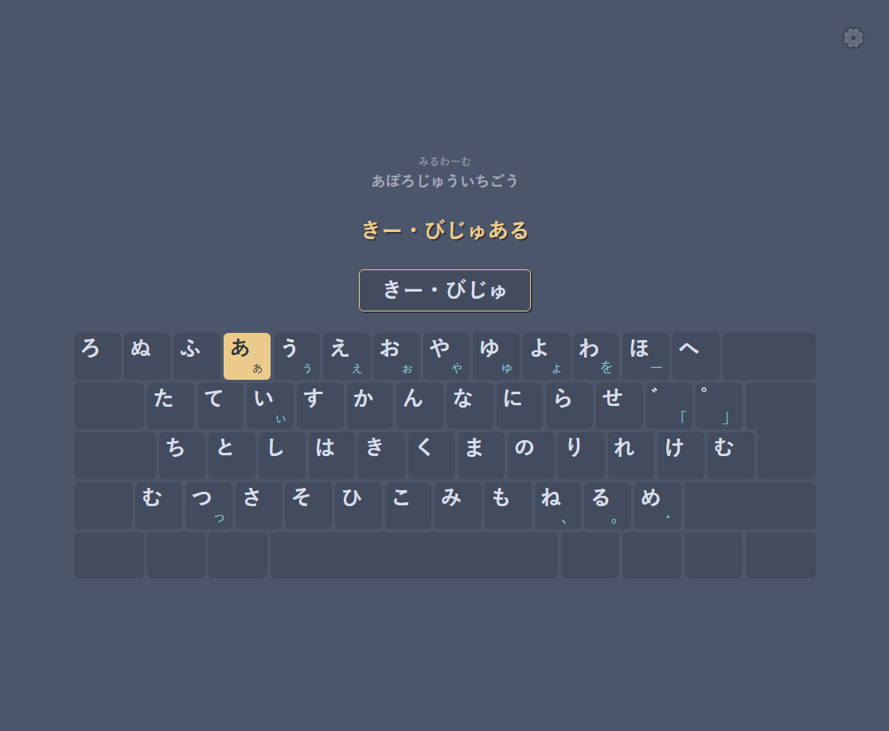
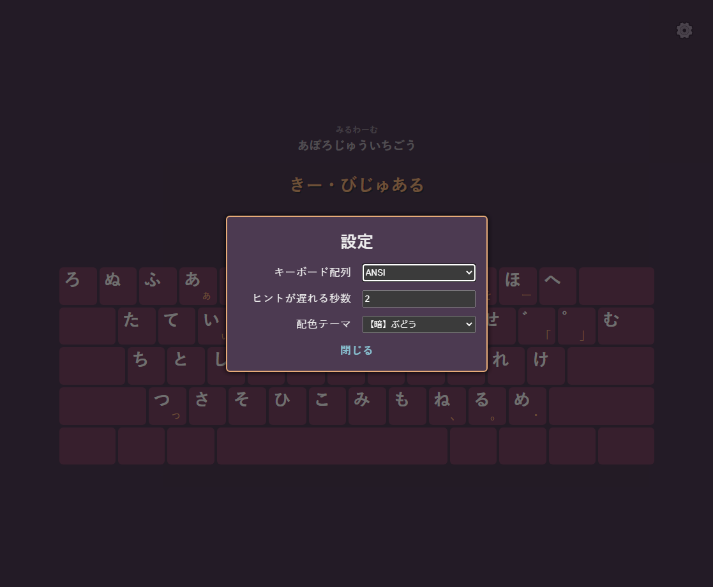

# Kana Input Practice

KIP is a static single-page application where you can practice typing Japanese by using the kana input method. Mobile is not supported. PRs welcome.

Note: The random word API is hosted on heroku so it will sometimes take a few seconds before the words are loaded.

## Screenshots

